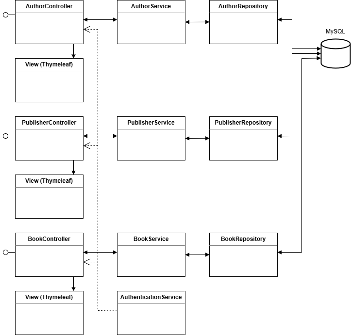

<h1>Книги</h1>

1. Project description
2. Architecture
3. Technologies
4. How to run
5. Used links
6. Database
7. Tests
8. Дополнительно

## 1. Project description
Library System — CRUD для библиотеки.

Система состоит из:
- веб-приложения
- REST
- БД

В приложении два пользователя: admin и user с такими же паролями. Admin может всё, user - только читать.

## 2. Architecture

## 3. Technologies
Java 21  
Spring Boot 3  
Spring Data JPA  
Spring Security 3  
Validation  
Thymeleaf  
MySQL 
Flyway  
Docker  
JUnit 5

## 4. How to run
git clone git@github.com:HappySeal2020/JRU-Final-Project.git  
docker compose up -d  
mvn clean install
## 5. Used links
| Тип  |Описание| Ссылка                                        |
|------|--------|-----------------------------------------------|
| http | GUI | http://localhost:8080/final-project/login     |
| REST | книги | http://localhost:8080/final-project/api/books      |
| REST | авторы | http://localhost:8080/final-project/api/authors    |
| REST | издатели | http://localhost:8080/final-project/api/publishers |
## 6. Database
Используется БД MySQL.  
Три сущности, связи Многие-к-Одному и Многие-ко-Многим. 
## 7. Tests
В проекте используются unit и интеграционные тесты.

## 8. Дополнительно
В проект были добавлены Actuator http://localhostfinal-project/actuator и Swagger http://localhost/final-project/swagger-ui/index.html .  
При помощи Docker приложение было размещено на бесплатном хостинге Railway (срок аренды закончился 02.03.2026).